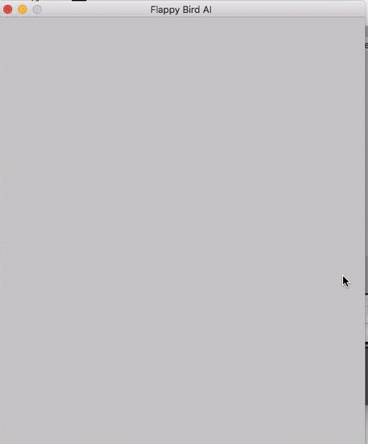

# flappy-bird-ai
Self learning flappy bird

The birds start by interacting with the environment and die the moment they hit a border or a pipe.
Birds that live longer are more likely to produce an offspring for the next generation of birds.

The pipes increase their speed by 10% after every 10 pipes.

Inputs to the neural network are horizontal distance to the next pipe, height above bottom pipe, height below top pipe and velocity of the bird.

Start.

Best bird.

The best bird only dies because the gravity is not strong enough.